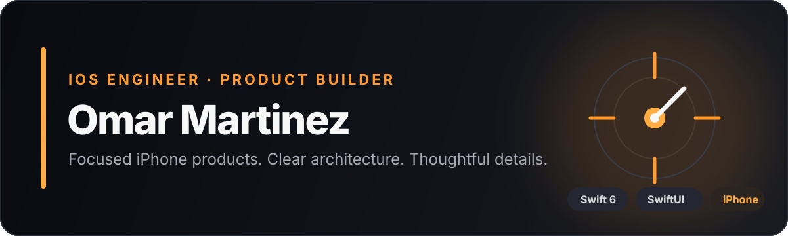

  

  <a href="https://omar-martinez-dev.github.io/"><strong>Portfolio</strong></a>
  &nbsp;·&nbsp;
  <a href="https://github.com/omar-martinez-dev/ostinova-showcase"><strong>Ostinova case study</strong></a>
  &nbsp;·&nbsp;
  <a href="https://martinezstudio.dev/"><strong>Martinez Studio</strong></a>

## Thoughtful iPhone products, end to end

I am an iOS engineer focused on turning real workflow problems into calm, reliable products. I enjoy owning the full path from product framing and interface design through architecture, platform integration, testing, and release preparation.

My current work centers on **SwiftUI**, **local-first data**, **audio and media workflows**, and **privacy-aware monetization**. I care about clear state ownership, purposeful interfaces, and technical decisions that remain understandable as a product grows.

> Most production application code is kept in private repositories. The public work below documents the product, architecture, tradeoffs, and quality strategy in detail. Private source access and a code walkthrough can be shared with hiring teams on request.

## Featured work — Ostinova

<table>
  <tr>
    <td width="34%" align="center">
      
    </td>
    <td width="66%" valign="top">
      <h3>A local-first practice companion for musicians</h3>
      
Ostinova brings metronome timing, reusable practice regimens, scale playback, recording, and review into one focused iPhone workflow.

      
<strong>What I designed and engineered:</strong>

      <ul>
        <li>SwiftUI feature architecture with explicit state ownership</li>
        <li>SwiftData persistence and filesystem-backed media</li>
        <li>AVFoundation audio, camera, recording, and playback</li>
        <li>StoreKit 2 purchases and privacy-aware AdMob behavior</li>
        <li>Unit, integration, UI smoke, and launch-performance coverage</li>
      </ul>
      

        <a href="https://github.com/omar-martinez-dev/ostinova-showcase"><strong>Explore the engineering case study →</strong></a>
      

    </td>
  </tr>
</table>

### Decisions worth discussing

- **Deterministic playback:** editable practice plans compile into immutable snapshots before a session starts, keeping live timing isolated from later UI changes.
- **Local-first storage:** searchable metadata lives in SwiftData while large audio and video payloads stay in the filesystem, balancing queryability with storage performance.
- **One privacy authority:** Apple’s ATT status directly determines AdMob configuration, avoiding contradictory controls and applying the user’s choice before future ad requests.

## Engineering focus

| Product and interface | Architecture and data | Platform and quality |
|---|---|---|
| SwiftUI · Observation | Swift 6 · SwiftData | AVFoundation · StoreKit 2 |
| Accessibility · design systems | Local-first persistence | Swift Testing · XCTest |
| Product framing · interaction design | Protocol boundaries · test doubles | ATT · Google Mobile Ads |

## How I work

- Start with the point where the user’s workflow is interrupted.
- Keep ownership and data flow explicit enough to explain on a whiteboard.
- Hide platform frameworks behind focused boundaries only where testing or change requires it.
- Treat privacy, accessibility, loading, and failure states as product behavior.
- Validate hardware-dependent behavior on real devices instead of assuming the simulator is sufficient.

## Currently

- Preparing Ostinova for release-quality real-device validation.
- Expanding coverage for audio routes, interruptions, capture, and long-running sessions.
- Documenting architecture and tradeoffs so product and engineering decisions are reviewable.

  <strong>Interested in iOS engineering opportunities with product-focused teams.</strong> 
  <a href="https://omar-martinez-dev.github.io/">View my portfolio</a>
  &nbsp;·&nbsp;
  <a href="https://github.com/omar-martinez-dev/ostinova-showcase">Review the case study</a>

